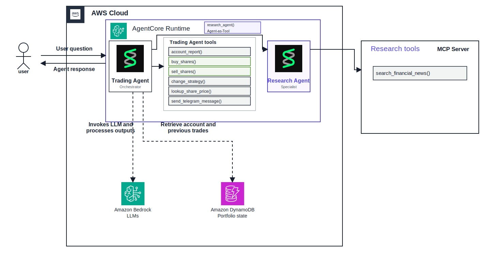

# Strands Trading Floor

An autonomous multi-trader simulation built with the [Strands Agents](https://strandsagents.com/) framework.
Four traders manage independent simulated portfolios, research financial news, inspect market prices, execute
trades, evolve their strategies, and send trading summaries through Telegram.

> This project is a simulation and must not be used to execute real-money trades.

## Architecture



The diagram is also available as an editable
[draw.io file](architecture/strands-trader-agentcore.drawio).

The runtime uses the Strands **agent-as-tool** pattern:

1. A **Trading Agent** orchestrates each trading cycle.
2. The Trading Agent owns the account, pricing, trading, strategy, and Telegram tools.
3. A dedicated **Research Agent** is registered on the Trading Agent with
   `researcher.as_tool(name="research_agent")`.
4. The Research Agent obtains `search_financial_news()` from a local stdio MCP server.
5. The Research Agent returns its findings to the Trading Agent, which remains responsible for all portfolio
   decisions and trade execution.

The diagram shows one trader to keep the architecture readable. The application runs the same structure for
Warren, George, Ray, and Cathie.

## Available tools

The Trading Agent can use:

- `account_report()`
- `buy_shares()`
- `sell_shares()`
- `change_strategy()`
- `lookup_share_price()`
- `send_telegram_message()`
- `research_agent()` — a wrapped Research Agent

The Research Agent receives this tool from the research MCP server:

- `search_financial_news()`

## Project structure

```text
src/trader/                 Strands agents, tools, accounts, scheduler, API, and MCP server
frontend/                   TypeScript and Vite dashboard
architecture/               Editable draw.io architecture, SVG preview, and icon assets
deploy/agentcore/           Amazon Bedrock AgentCore Runtime packaging
workshop/                   Step-by-step AWS deployment workshop
tests/                      Unit and architecture-support tests
data/                       Local SQLite runtime data; not committed
```

## Requirements

- Python 3.12 or newer
- [uv](https://docs.astral.sh/uv/)
- Node.js 20 or newer
- npm
- An API key for the selected model provider

AWS credentials are additionally required when using Amazon Bedrock, DynamoDB, or AgentCore.

## Installation

From the repository root:

```powershell
uv sync --extra dev
Copy-Item .env.example .env

cd frontend
npm install
cd ..
```

Configure at least the model provider and its API key in `.env`:

```dotenv
MODEL_PROVIDER=openai
MODEL_ID=gpt-5.4-mini
OPENAI_API_KEY=

TAVILY_API_KEY=
MASSIVE_API_KEY=
TELEGRAM_BOT_TOKEN=
TELEGRAM_CHAT_ID=
```

Supported OpenAI-compatible providers include `openai`, `deepseek`, `grok`, `gemini`, and `openrouter`.
To use Amazon Bedrock:

```dotenv
MODEL_PROVIDER=bedrock
MODEL_ID=your-bedrock-model-id
AWS_REGION=us-west-2
```

## Running the dashboard

Start the FastAPI backend in the first terminal:

```powershell
uv run trader api
```

Start the Vite frontend in a second terminal:

```powershell
cd frontend
npm run dev
```

Open [http://localhost:5173](http://localhost:5173). Vite proxies `/api` requests to FastAPI at
`http://127.0.0.1:8000`.

## Backend commands

```powershell
uv run trader reset  # Reset all four simulated accounts
uv run trader once   # Run one trading cycle
uv run trader run    # Run the continuous scheduler
uv run trader api    # Start the FastAPI dashboard backend
uv run trader ui     # Start the optional Gradio dashboard
```

## Storage

SQLite is used by default:

```dotenv
STORAGE_BACKEND=sqlite
```

For an AWS deployment, portfolio state and logs can be stored in DynamoDB:

```dotenv
STORAGE_BACKEND=dynamodb
DYNAMODB_TABLE=strands-trader-state
AWS_REGION=us-west-2
```

## Tests and code quality

```powershell
uv run pytest
uv run ruff check src tests architecture/generate_architecture.py
cd frontend
npm run build
```

## Amazon Bedrock AgentCore workshop

The [AWS workshop](workshop/README.md) explains how to package and deploy the application to Amazon Bedrock
AgentCore Runtime. It covers Bedrock configuration, DynamoDB state, MCP integration, observability, validation,
and resource cleanup.

AgentCore deployment assets are located in [`deploy/agentcore`](deploy/agentcore).

## Current safety boundaries

The account implementation rejects non-positive quantities, purchases without sufficient cash, and sales without
sufficient holdings. It does not yet provide production-grade portfolio risk controls, broker integration, order
approval, compliance checks, or real-money execution.

## License and third-party assets

AWS architecture icons are sourced from the official AWS Architecture Icons package. The Strands mark used in the
architecture is sourced from the official
[Strands Agents GitHub organization](https://github.com/strands-agents).
